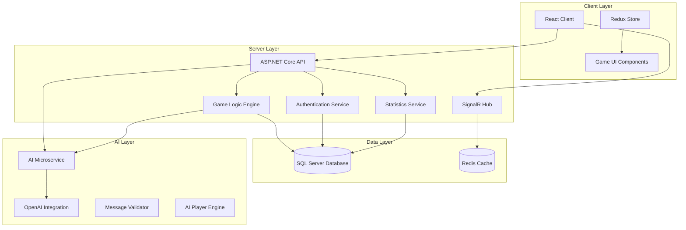
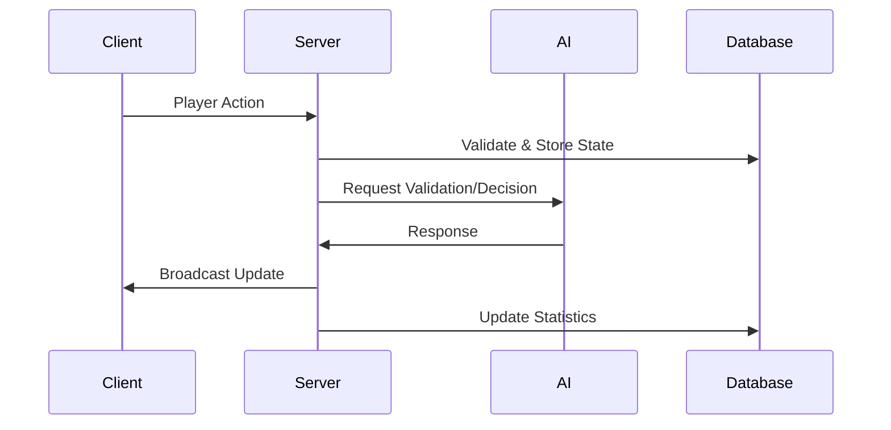

# Design Document

## Overview

The virtual implementation of "The Game" follows a distributed microservices architecture with three main components:

1. **React Client** - Handles UI/UX, game visualization, client-side validation, and state management
2. **.NET Server** - Manages game logic, session management, real-time communication, and data persistence
3. **Python AI Microservice** - Provides AI player behavior and message validation services

The system is designed to scale from single-player experiences in Phase 1 to complex multiplayer scenarios with AI integration and administrative oversight in later phases.

## Architecture

### High-Level System Architecture



### Component Communication Flow



## Components and Interfaces

### React Client Architecture

#### State Management (Redux)
```typescript
interface GameState {
  // Game Session
  sessionId: string | null;
  gamePhase: 'lobby' | 'playing' | 'ended';
  
  // Game Board
  ascendingPiles: [number, number]; // Top cards of ascending piles
  descendingPiles: [number, number]; // Top cards of descending piles
  drawPileCount: number;
  playedCardsCount: number;
  
  // Player State
  playerHand: number[];
  currentPlayer: string;
  players: Player[];
  spectators: Spectator[];
  
  // UI State
  selectedCards: number[];
  validMoves: ValidMove[];
  gameMessages: ChatMessage[];
}

interface Player {
  id: string;
  username: string;
  isAI: boolean;
  handCount: number;
  isActive: boolean;
  isDisconnected: boolean;
}

interface ValidMove {
  cardValue: number;
  pileIndex: number;
  isBackwardsTrick: boolean;
}
```

#### Key Components
- **GameBoard**: Renders the four piles and handles card placement
- **PlayerHand**: Displays player's cards with selection capabilities
- **ChatSystem**: Handles communication with rule enforcement feedback
- **GameLobby**: Manages game creation, joining, and configuration
- **PlayerDashboard**: Shows statistics and game history
- **AdminPanel**: Administrative functions and system monitoring

### .NET Server Architecture

#### Core Services

```csharp
public interface IGameService
{
    Task<GameSession> CreateGameAsync(CreateGameRequest request);
    Task<GameSession> JoinGameAsync(string sessionId, string playerId);
    Task<MoveResult> PlayCardsAsync(string sessionId, string playerId, List<CardPlay> moves);
    Task<bool> ValidateMoveAsync(CardPlay move, GameState state);
    Task EndGameAsync(string sessionId, GameEndReason reason);
}

public interface IAuthenticationService
{
    Task<AuthResult> RegisterAsync(RegisterRequest request);
    Task<AuthResult> LoginAsync(LoginRequest request);
    Task<bool> ValidateSessionAsync(string sessionToken);
    Task LogoutAsync(string sessionToken);
}

public interface IStatisticsService
{
    Task RecordGameResultAsync(GameResult result);
    Task<PlayerStats> GetPlayerStatsAsync(string playerId);
    Task<AdminStats> GetAdminStatsAsync();
}
```

#### SignalR Hubs
```csharp
public class GameHub : Hub
{
    public async Task JoinGameGroup(string sessionId);
    public async Task LeaveGameGroup(string sessionId);
    public async Task SendChatMessage(string sessionId, string message);
    
    // Real-time game updates
    public async Task BroadcastGameUpdate(string sessionId, GameUpdateDto update);
    public async Task BroadcastPlayerAction(string sessionId, PlayerActionDto action);
}
```

### Python AI Microservice Architecture

#### Core Components

```python
class MessageValidator:
    def __init__(self, openai_client):
        self.openai_client = openai_client
    
    async def validate_message(self, message: str, game_context: GameContext) -> ValidationResult:
        """Validates chat messages against game communication rules"""
        pass

class AIPlayer:
    def __init__(self, openai_client):
        self.openai_client = openai_client
    
    async def make_move(self, game_state: GameState, player_hand: List[int]) -> List[CardPlay]:
        """Determines optimal card plays for AI player"""
        pass
    
    async def generate_message(self, game_context: GameContext) -> str:
        """Generates contextually appropriate chat messages"""
        pass

class AIService:
    def __init__(self):
        self.message_validator = MessageValidator(openai_client)
        self.ai_player = AIPlayer(openai_client)
    
    async def process_request(self, request: AIRequest) -> AIResponse:
        """Main entry point for AI service requests"""
        pass
```

#### API Endpoints
```python
@app.post("/validate-message")
async def validate_message(request: MessageValidationRequest):
    """Validates chat message against game rules"""
    pass

@app.post("/ai-move")
async def get_ai_move(request: AIMoveRequest):
    """Gets AI player's next move"""
    pass

@app.post("/ai-message")
async def generate_ai_message(request: AIMessageRequest):
    """Generates AI chat message"""
    pass
```

## Data Models

### Database Schema

#### Users and Authentication
```sql
CREATE TABLE Users (
    Id UNIQUEIDENTIFIER PRIMARY KEY,
    Username NVARCHAR(50) UNIQUE NOT NULL,
    PasswordHash NVARCHAR(255) NOT NULL,
    IsAdmin BIT DEFAULT 0,
    CreatedAt DATETIME2 DEFAULT GETUTCDATE(),
    LastLoginAt DATETIME2
);

CREATE TABLE UserSessions (
    Id UNIQUEIDENTIFIER PRIMARY KEY,
    UserId UNIQUEIDENTIFIER FOREIGN KEY REFERENCES Users(Id),
    SessionToken NVARCHAR(255) UNIQUE NOT NULL,
    ExpiresAt DATETIME2 NOT NULL,
    CreatedAt DATETIME2 DEFAULT GETUTCDATE()
);
```

#### Game Sessions and State
```sql
CREATE TABLE GameSessions (
    Id UNIQUEIDENTIFIER PRIMARY KEY,
    CreatedBy UNIQUEIDENTIFIER FOREIGN KEY REFERENCES Users(Id),
    GamePhase NVARCHAR(20) NOT NULL, -- 'lobby', 'playing', 'ended'
    MaxPlayers INT NOT NULL,
    IsExpertMode BIT DEFAULT 0,
    CustomRules NVARCHAR(MAX), -- JSON
    CreatedAt DATETIME2 DEFAULT GETUTCDATE(),
    StartedAt DATETIME2,
    EndedAt DATETIME2
);

CREATE TABLE GamePlayers (
    Id UNIQUEIDENTIFIER PRIMARY KEY,
    GameSessionId UNIQUEIDENTIFIER FOREIGN KEY REFERENCES GameSessions(Id),
    UserId UNIQUEIDENTIFIER FOREIGN KEY REFERENCES Users(Id),
    PlayerIndex INT NOT NULL,
    IsAI BIT DEFAULT 0,
    IsSpectator BIT DEFAULT 0,
    JoinedAt DATETIME2 DEFAULT GETUTCDATE(),
    DisconnectedAt DATETIME2,
    ReplacedByAI BIT DEFAULT 0
);

CREATE TABLE GameStates (
    Id UNIQUEIDENTIFIER PRIMARY KEY,
    GameSessionId UNIQUEIDENTIFIER FOREIGN KEY REFERENCES GameSessions(Id),
    CurrentPlayerId UNIQUEIDENTIFIER,
    AscendingPile1 INT DEFAULT 1,
    AscendingPile2 INT DEFAULT 1,
    DescendingPile1 INT DEFAULT 100,
    DescendingPile2 INT DEFAULT 100,
    DrawPileCards NVARCHAR(MAX), -- JSON array
    PlayedCardsCount INT DEFAULT 0,
    UpdatedAt DATETIME2 DEFAULT GETUTCDATE()
);

CREATE TABLE PlayerHands (
    Id UNIQUEIDENTIFIER PRIMARY KEY,
    GameSessionId UNIQUEIDENTIFIER FOREIGN KEY REFERENCES GameSessions(Id),
    PlayerId UNIQUEIDENTIFIER FOREIGN KEY REFERENCES GamePlayers(Id),
    Cards NVARCHAR(MAX) NOT NULL, -- JSON array
    UpdatedAt DATETIME2 DEFAULT GETUTCDATE()
);
```

#### Statistics and Game History
```sql
CREATE TABLE GameResults (
    Id UNIQUEIDENTIFIER PRIMARY KEY,
    GameSessionId UNIQUEIDENTIFIER FOREIGN KEY REFERENCES GameSessions(Id),
    TotalCardsRemaining INT NOT NULL,
    IsPerfectGame BIT DEFAULT 0,
    GameDurationMinutes INT,
    EndReason NVARCHAR(50), -- 'completed', 'disconnection', 'admin_ended'
    CompletedAt DATETIME2 DEFAULT GETUTCDATE()
);

CREATE TABLE PlayerGameStats (
    Id UNIQUEIDENTIFIER PRIMARY KEY,
    GameResultId UNIQUEIDENTIFIER FOREIGN KEY REFERENCES GameResults(Id),
    UserId UNIQUEIDENTIFIER FOREIGN KEY REFERENCES Users(Id),
    CardsInHand INT NOT NULL,
    WasReplacedByAI BIT DEFAULT 0,
    PlayTimeMinutes INT
);

CREATE TABLE PlayerStatistics (
    UserId UNIQUEIDENTIFIER PRIMARY KEY FOREIGN KEY REFERENCES Users(Id),
    TotalGames INT DEFAULT 0,
    PerfectGames INT DEFAULT 0,
    BestScore INT, -- Fewest remaining cards
    AverageRemainingCards DECIMAL(5,2),
    TotalPlayTimeMinutes INT DEFAULT 0,
    AIAssistedGames INT DEFAULT 0,
    LastUpdated DATETIME2 DEFAULT GETUTCDATE()
);
```

#### Chat and Communication
```sql
CREATE TABLE ChatMessages (
    Id UNIQUEIDENTIFIER PRIMARY KEY,
    GameSessionId UNIQUEIDENTIFIER FOREIGN KEY REFERENCES GameSessions(Id),
    UserId UNIQUEIDENTIFIER FOREIGN KEY REFERENCES Users(Id),
    Message NVARCHAR(500) NOT NULL,
    IsValidated BIT DEFAULT 1,
    ValidationReason NVARCHAR(255),
    SentAt DATETIME2 DEFAULT GETUTCDATE()
);
```

### Redis Cache Schema

#### Session Management
```
Key: "session:{sessionToken}"
Value: {
  "userId": "guid",
  "username": "string",
  "isAdmin": boolean,
  "expiresAt": "datetime"
}
TTL: Session timeout duration
```

#### Active Game States
```
Key: "game:{sessionId}:state"
Value: {
  "gamePhase": "string",
  "currentPlayer": "guid",
  "piles": [1, 1, 100, 100],
  "drawPileCount": number,
  "playedCardsCount": number
}

Key: "game:{sessionId}:players"
Value: [
  {
    "id": "guid",
    "username": "string",
    "isAI": boolean,
    "handCount": number,
    "isActive": boolean
  }
]
```

## Error Handling

### Client-Side Error Handling
- **Network Errors**: Automatic retry with exponential backoff
- **Validation Errors**: Real-time feedback with specific error messages
- **Session Expiry**: Automatic redirect to login with session restoration
- **Game State Conflicts**: Server state reconciliation

### Server-Side Error Handling
- **Database Failures**: Circuit breaker pattern with fallback to cache
- **AI Service Unavailable**: Graceful degradation with rule-based fallbacks
- **Invalid Game States**: State validation and correction mechanisms
- **Concurrent Modifications**: Optimistic locking with conflict resolution

### AI Service Error Handling
- **OpenAI API Failures**: Retry logic with fallback to rule-based decisions
- **Invalid Requests**: Comprehensive input validation and sanitization
- **Timeout Handling**: Configurable timeouts with default responses

## Testing Strategy

### Unit Testing
- **Client Components**: Jest + React Testing Library
- **Redux Logic**: Redux toolkit testing utilities
- **Server Services**: xUnit with mocking frameworks
- **AI Components**: pytest with mock OpenAI responses

### Integration Testing
- **API Endpoints**: ASP.NET Core TestServer
- **SignalR Hubs**: SignalR test client
- **Database Operations**: In-memory database testing
- **AI Service Integration**: Containerized testing environment

### End-to-End Testing
- **Game Flows**: Playwright for full game scenarios
- **Multiplayer Scenarios**: Multiple browser instances
- **AI Integration**: Automated AI vs human game testing
- **Performance Testing**: Load testing with multiple concurrent games

### Phase-Specific Testing Considerations

#### Phase 1 Testing
- Single-player game mechanics
- Authentication and registration flows
- Statistics tracking accuracy
- Client-server communication

#### Phase 2 Testing
- Multiplayer synchronization
- Real-time communication
- Chat message validation
- Disconnection handling

#### Phase 3 Testing
- AI player behavior validation
- Seamless AI replacement
- Message validation accuracy
- Performance under AI load

#### Phase 4 Testing
- Spectator functionality
- Admin privileges and security
- Rule customization validation
- Complex multi-user scenarios

## Security Considerations

### Authentication and Authorization
- **Password Security**: bcrypt hashing with salt
- **Session Management**: Secure token generation with appropriate expiration
- **Role-Based Access**: Admin vs regular user permissions
- **API Security**: JWT tokens with proper validation

### Data Protection
- **Input Validation**: Comprehensive sanitization of all user inputs
- **SQL Injection Prevention**: Parameterized queries and ORM usage
- **XSS Protection**: Content Security Policy and input encoding
- **CSRF Protection**: Anti-forgery tokens for state-changing operations

### Communication Security
- **HTTPS Enforcement**: All client-server communication encrypted
- **WebSocket Security**: Secure WebSocket connections (WSS)
- **API Rate Limiting**: Prevent abuse and DoS attacks
- **Message Validation**: AI-powered content filtering for chat

### AI Service Security
- **API Key Management**: Secure storage and rotation of OpenAI keys
- **Request Validation**: Strict input validation for AI requests
- **Response Sanitization**: Validation of AI-generated content
- **Audit Logging**: Comprehensive logging of AI decisions and validations

## Performance Optimization

### Client-Side Optimization
- **Code Splitting**: Lazy loading of phase-specific components
- **State Management**: Efficient Redux selectors and memoization
- **Asset Optimization**: Image compression and CDN usage
- **Caching Strategy**: Browser caching for static assets

### Server-Side Optimization
- **Database Indexing**: Optimized indexes for frequent queries
- **Connection Pooling**: Efficient database connection management
- **Caching Layer**: Redis for frequently accessed data
- **Background Processing**: Async processing for statistics updates

### Real-Time Communication
- **SignalR Scaling**: Redis backplane for multi-server scenarios
- **Message Batching**: Efficient batching of game state updates
- **Connection Management**: Proper cleanup of disconnected clients
- **Bandwidth Optimization**: Minimal payload sizes for real-time updates

### AI Service Optimization
- **Response Caching**: Cache common AI decisions and validations
- **Request Batching**: Batch multiple AI requests when possible
- **Model Optimization**: Use appropriate OpenAI models for different tasks
- **Fallback Mechanisms**: Fast rule-based fallbacks for AI failures

## Deployment Architecture

### Development Environment
- **Local Development**: Docker Compose for full stack
- **Database**: SQL Server LocalDB or Docker container
- **Cache**: Redis Docker container
- **AI Service**: Local Python development server

### Production Environment
- **Client**: Static hosting (Azure Static Web Apps or AWS S3/CloudFront)
- **Server**: Container orchestration (Azure Container Apps or AWS ECS)
- **Database**: Managed SQL Server (Azure SQL or AWS RDS)
- **Cache**: Managed Redis (Azure Cache or AWS ElastiCache)
- **AI Service**: Serverless functions (Azure Functions or AWS Lambda)

### Monitoring and Observability
- **Application Monitoring**: Application Insights or CloudWatch
- **Performance Metrics**: Custom dashboards for game-specific metrics
- **Error Tracking**: Centralized error logging and alerting
- **Health Checks**: Comprehensive health monitoring for all services